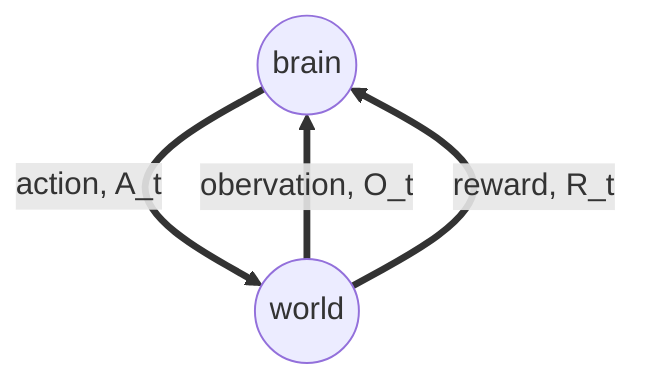

lecture note for RL(reinforcement learning)
========
<!-- TOC -->

- [lecture note for RL(reinforcement learning)](#lecture-note-for-rlreinforcement-learning)
- [1. lecture 1](#1-lecture-1)
  - [1.1. reward](#11-reward)
  - [1.2. sequential decision making](#12-sequential-decision-making)
  - [1.3. agent and environment](#13-agent-and-environment)
  - [1.4. History and State](#14-history-and-state)
    - [1.4.1. History](#141-history)
    - [1.4.2. State](#142-state)
      - [Environment State, Agent State and Information State](#environment-state-agent-state-and-information-state)
    - [model](#model)
    - [policy](#policy)
    - [value based and policy based actor critic](#value-based-and-policy-based-actor-critic)
    - [exploration and expliotation](#exploration-and-expliotation)
- [2. lecture 2](#2-lecture-2)
  - [2.1. Markov Decision Process(MDP)](#21-markov-decision-processmdp)
    - [2.1.1. Markov Reward Process(MRP)](#211-markov-reward-processmrp)
    - [2.1.2. return <math><semantics><mrow><msub><mi>G</mi><mi>t</mi></msub></mrow><annotation encoding="application/x-tex">G_t</annotation></semantics></math>Gt​](#212-return-mathsemanticsmrowmsubmigmimitmimsubmrowannotation-encoding%22applicationx-tex%22gtannotationsemanticsmathgt%e2%80%8b)
      - [2.1.2.1. why discount](#2121-why-discount)
    - [2.1.3. Value Function](#213-value-function)
    - [2.1.4. Bellman equation for MRPs](#214-bellman-equation-for-mrps)
  - [Markov Decision Process(MDP)](#markov-decision-processmdp)

<!-- /TOC -->

reference

```latex
@book{Sutton1998Reinforcement,
  title={Reinforcement Learning:An Introduction},
  author={Sutton, R and Barto, A},
  year={1998},
}
```

# 1. lecture 1


## 1.1. reward

rewards $R_t$ : a scalar feedback signal, different state we can give different rewards, and weights for this state.
* how well agent is doing at step $t$
* maximize cumulative rewards

> rewards hypothesis:\
> All goals can be described by the maximization of expected cumulative reward

## 1.2. sequential decision making

select actions to maximize total future reward
* may be better to sacrifice immediate reward to gain more long-term reward
* reward may be delayed

## 1.3. agent and environment



## 1.4. History and State

### 1.4.1. History

$H_t$, the sequence of observations, actions, rewards 
$$H_t  = A_1, O_1, R_1, \cdots, A_t, O_t, R_t$$

### 1.4.2. State

#### Environment State, Agent State and Information State
usually we use agent state since the information used to determine what happens next;
in environment state the infomation is not usually visible to the agent, and contains irrelevant information

* Formally, state is a function of the history: $S_t = f(H_t)$

the informationused by reinforcement learning algorithms
$$\mathbb{P}[S_{t+1} | S_{t}] = \mathbb{P}[S_{t+1} | S_1, \cdots, S_t] $$

### model

* predicts what the environment will do next
* transitions: $\mathcal{P}$ predicts the next state(i.e. dynamics)
* Rewards: $\mathcal{R}$ predicts the next (immediate) reward

### policy

the agent's behaviour
map from state to action, $a=\pi(s)$
stochastic policy: $\pi(a|s) = $

### value based and policy based actor critic

### exploration and expliotation
* Exploration finds more information about the environment
* Exploitation exploits known information to maximise reward
* It is usually important to explore as well as exploit


# 2. lecture 2

## 2.1. Markov Decision Process(MDP)

### 2.1.1. Markov Reward Process(MRP)

 Markov chain with reward values, a tuple like:
$\langle \mathcal{ S, P, \color{red}{ R, \gamma} } \rangle$

* $\mathcal{S}$ is a finite set of states;
* $\mathcal{P}$ : state transition probability matrix
  $$\mathcal{P_{ss'}}= \mathbb{P}[ S_{t+1} = s' | S_t = s ]$$
* $\mathcal{R}$ : reward function
  $$ \mathcal{R_s} = \mathbb{E}[ R_{t+1} | S_t = s  ] $$
* $\mathcal{\gamma}$ : discount factor, $\mathcal{\gamma} \in [0,1]$

>note: 折扣因子 γ∈[0,1] 表示未来的奖励在当前的价值. 由于未来的奖励充满不确定性, 因此需要乘上折扣因子;γ 接近 0表明更注重当前的奖励(myopic);γ接近 1 表明更具有远见(far-sighted).


### 2.1.2. return $G_t$

the total discounted reward from time-step $\textit{t}$.
$$G_t = R_{t+1} + \gamma R_{t+2} + \cdots =  \sum^{\infty}_{k=0}\gamma ^k R_{t+k+1}$$

#### 2.1.2.1. why discount

* Mathematically convenient to discount rewards(easy to understand)
* Avoids infinite returns in cyclic Markov processes
* Uncertainty about the future may not be fully represented
* If the reward is financial, immediate rewards may earn more
* interest than delayed rewards
* Animal/human behavior shows preference for immediate reward
* It is sometimes possible to use un-discounted Markov reward processes (i.e.γ= 1), e.g.  if all sequences terminate.

### 2.1.3. Value Function

v(s) gives the long-term value of state s:
> The state value function v(s) of an MRP is the expected return starting from states
> $$v(s)=\mathbb{E}[G_t|S_t=s]$$

### 2.1.4. Bellman equation for MRPs

value function can be decomposed into two parts:

* immediate reward $R_{t+1}$;
* discounted value of successor state $\gamma v(S_{t+1})$

$$
\begin{aligned}
v(s) &= \mathbb{E}[G_t | S_t = s] \\
&= \mathbb{E}[R_{t+1} + \gamma R_{t+2} + \cdot | S_t = s] \\
&= \mathbb{E}[R_{t+1} + \gamma v(S_{t+1}) | S_t = s]
\end{aligned}
$$

that's:

$$
v(s) = \mathcal{R}_s + \gamma\sum_{s' \in \mathcal{S}}\mathcal{P}_{ss'}v(s')
$$

in matrix form:

$$
\begin{aligned}
  \mathcal{V} &= \mathcal{R} + \gamma\mathcal{P}\mathcal{V} \\
  \mathcal{V} &= (\mathit{I} - \gamma\mathcal{P})^{-1}\mathcal{R}
\end{aligned}
$$
here, $\mathcal{V}$ and $\mathcal{R}$ is $n*1$ vector; $\mathcal{P}$ is $n*n$ matrix.

* The Bellman equation is a linear equation
* Computational complexity is $O(n^3)$ for n states
* Direct solution only possible for small MRPs
* There are many iterative methods for large MRPs, e.g.
  * Dynamic programming
  * Monte-Carlo evaluation
  * Temporal-Difference learning

## Markov Decision Process(MDP)

A Markov decision process (MDP) is a Markov reward process with decisions.  It is an environment in which all states are Markov.
> what does it mean of environment?\
> environment

a tuple like:
$\langle \mathcal{ S, \textcolor{red}{A}, P, R, \gamma } \rangle$

* $\mathcal{S}$ is a finite set of states;
* $\mathcal{A}$ is a finite set of actions;
* $\mathcal{P}$ : state transition probability matrix
  $$\mathcal{P^a_{ss'}}= \mathbb{P}[ S_{t+1} = s' | S_t = s , A_t = a]$$
* $\mathcal{R}$ : reward function
  $$ \mathcal{R^a_s} = \mathbb{E}[ R_{t+1} | S_t = s ,A_t=a ] $$
* $\mathcal{\gamma}$ : discount factor, $\mathcal{\gamma} \in [0,1]$