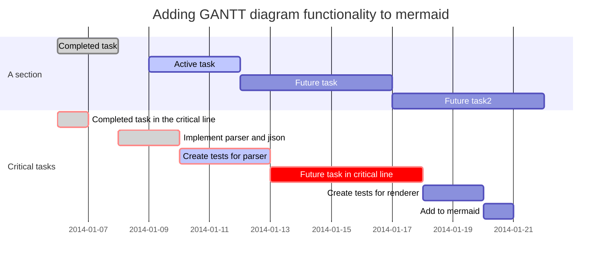
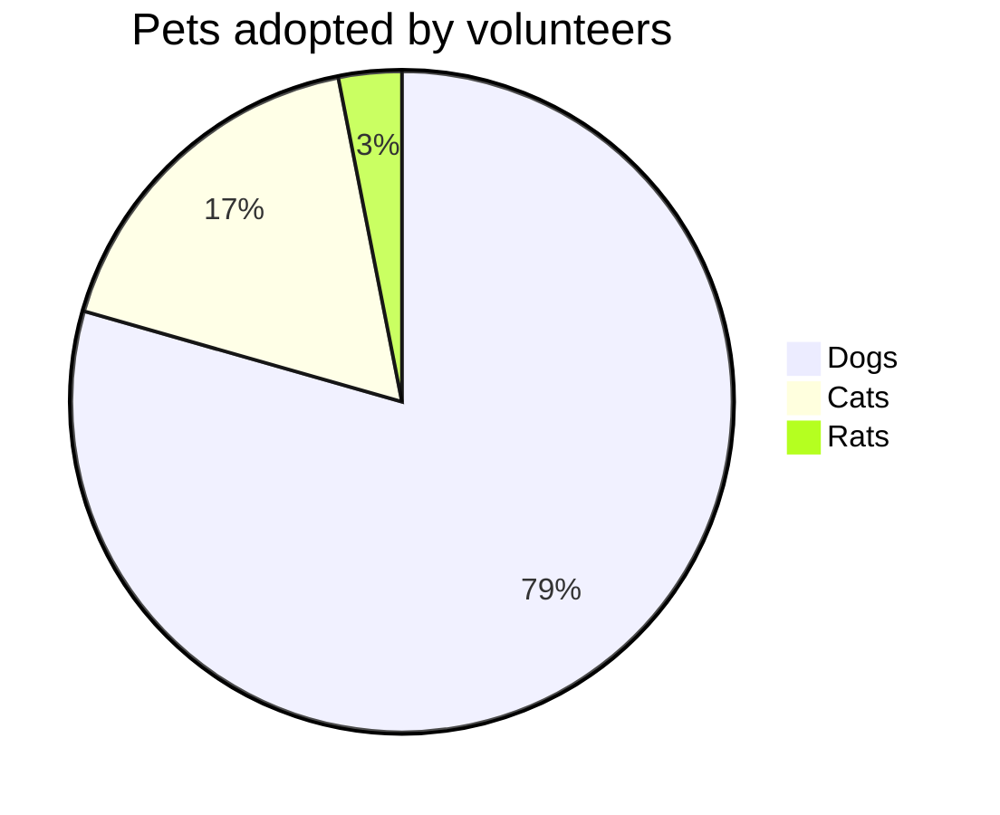
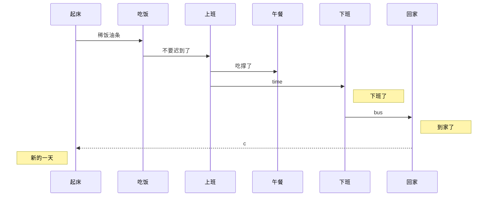

reference
1. [乾坤平台](https://qiankunpingtai.cn/article/1558878943974)
2. [mermaid](https://mermaid-js.github.io/mermaid/#/pie)
3. [more drawing plugin](https://shd101wyy.github.io/markdown-preview-enhanced/#/diagrams?id=mermaid)
4. [mermaid online tool](https://mermaidjs.github.io/ermaid-live-editor/)



```flow
st=>start: Start|past:>http://www.google.com[blank]
e=>end: End:>http://www.google.com
op1=>operation: get_hotel_ids|past
op2=>operation: get_proxy|current
sub1=>subroutine: get_proxy|current
op3=>operation: save_comment|current
op4=>operation: set_sentiment|current
op5=>operation: set_record|current

cond1=>condition: ids_remain空?
cond2=>condition: proxy_list空?
cond3=>condition: ids_got空?
cond4=>condition: 爬取成功??
cond5=>condition: ids_remain空?

io1=>inputoutput: ids-remain
io2=>inputoutput: proxy_list
io3=>inputoutput: ids-got

st->op1(right)->io1->cond1
cond1(yes)->sub1->io2->cond2
cond2(no)->op3
cond2(yes)->sub1
cond1(no)->op3->cond4
cond4(yes)->io3->cond3
cond4(no)->io1
cond3(no)->op4
cond3(yes, right)->cond5
cond5(yes)->op5
cond5(no)->cond3
op5->e 
```





```latex {cmd=true}
\documentclass{standalone}
\begin{document}
   Hello world!
\end{document}
```